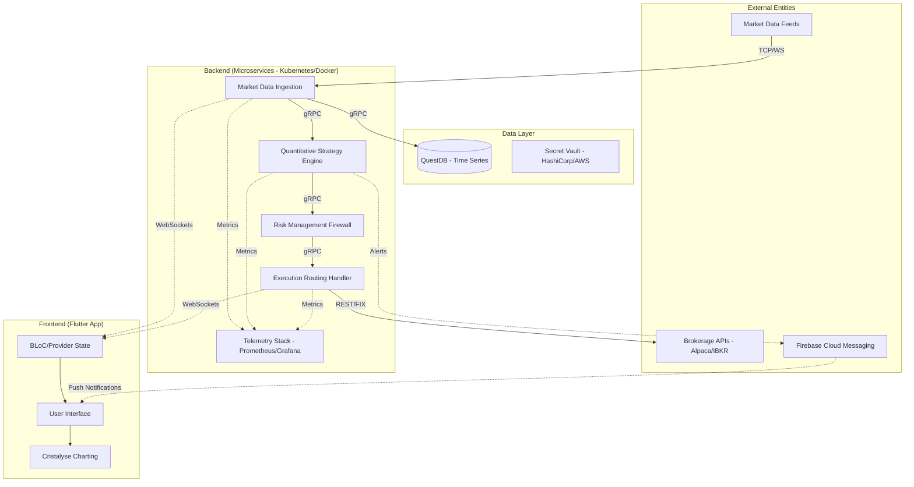
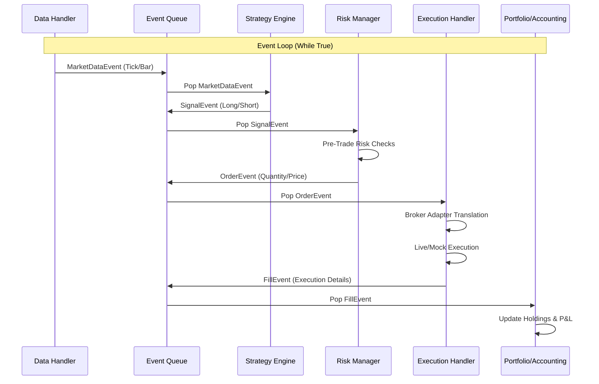
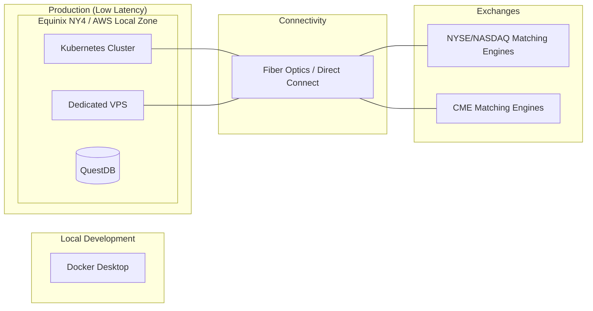

# Automated Trading System: Diagrams & Designs

Based on the **Comprehensive Blueprint**, the following diagrams illustrate the architectural and operational design of the system.

## 1. High-Level System Architecture
This diagram shows the microservices-based topology, communication protocols, and data flow.

---

## 2. Event-Driven Execution Loop
The core simulation and live execution sequence using the event-driven paradigm.

---

## 3. Infrastructure Topology
Deployment strategy for low-latency execution and high availability.

---

## 4. UI Design Concept (Dashboard)
A conceptual design for the Flutter-based command center.

> [!TIP]
> The UI leverages **GPU-accelerated charting** and **BLoC pattern** for 60fps performance during high-volatility events.

| Component | Functionality |
| :--- | :--- |
| **Global Kill Switch** | Ultimate-priority gRPC command to flatten all positions. |
| **Real-time P&L** | WebSocket-driven live equity curve and drawdown monitoring. |
| **Strategy Toggle** | Individual control for various algorithmic modules. |
| **Tick-Level Charts** | Multi-axis visualization using the Cristalyse library. |
| **Composite Alerts** | Correlated event notifications (e.g., Volatility + Rejection Rate). |

---

### Next Steps
1. **Implementation:** Start building the `Market Data Ingestion` microservice.
2. **Setup:** Initialize the QuestDB instance and Prometheus/Grafana stack.
3. **Frontend:** Scaffold the Flutter application with the BLoC pattern.
